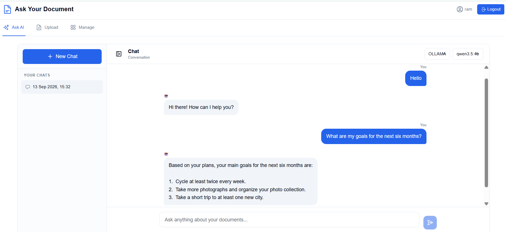
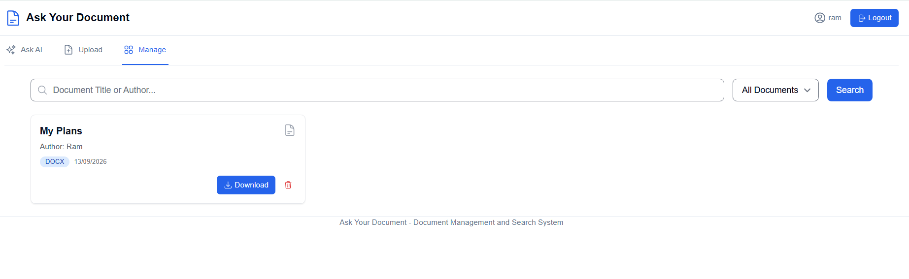

# Ask Your Document

Ask Your Document is an AI-powered document assistant that lets authenticated users maintain their personal documents and chat with an AI about their content.
Documents are processed asynchronously, stored in object storage, and indexed in a vector database for semantic search. 
During an AI conversation, the LLM can retrieve relevant document context from the vector store when needed to provide grounded answers.

---

## Features

- **AI Chat with Conversation Memory**: Have natural conversations with an AI assistant and maintain context across conversations.
- **RAG-powered Answers**: The AI can search the document vector store when additional context is required.
- **Multiple AI Provider Support**: Switch seamlessly between cloud LLMs (OpenAI models like GPT-4o / GPT-5) and locally 
hosted models (Ollama with models like Qwen, Llama 3.1).
- **Enterprise Security & Access Control**: Complete authentication and authorization powered by Keycloak OAuth2/OIDC,
  supporting fine-grained resource and conversation access policies.
- **Modern Responsive UI**: Clean, responsive frontend for easy conversation.
---
  


---
## Technical Architecture
The system follows a microservices/event-driven modular architecture designed for high scalability, fault tolerance, and security.

```
                  +-------------------------------+
                  |        React Frontend         |
                  |     (Vite + Tailwind CSS)     |
                  +---------------+---------------+
                                  |
                           HTTP / REST / SSE
                                  |
                                  v
+------------------+     +-------------------------------+     +--------------------+
|  Keycloak OIDC   |<--->|      Spring Boot Backend      |<--->|   PostgreSQL DB    |
| (Auth & Policies)|     |   (Spring AI + Web/Security)  |     | (Metadata, Memory) |
+------------------+     +---+-------------------+-------+     +--------------------+
                             |                   |
                    Document Upload            AI Chat
                             |                   |
                             v                   v
                     +---------------+     +-------------------+
                     | Apache Kafka  |     |  Ollama / OpenAI |
                     |  (Event Bus)  |     |       LLMs       |
                     +-------+-------+     +---------+---------+
                             |                       |
                    Document Ingestion                |
                             |                       | RAG when required
                             v                       |
                     +---------------+               |
                     |   Document    |               |
                     |   Processing  |               |
                     +-------+-------+               |
                             |                       |
                    +--------+--------+              |
                    |                 |              |
                    v                 v              v
             +-------------+   +-------------+   +---+---------+
             |    MinIO    |   |   Qdrant    |<--|   Vector    |
             | Raw Docs    |   | Vector Store|   |   Search    |
             +-------------+   +-------------+   +-------------+
                                                   |
                                                   | Relevant
                                                   | Context
                                                   v
                                             Ollama / OpenAI
                                                   |
                                                   v
                                              AI Response       
```

## Run on Local Docker

The repository includes docker-compose definitions in the `docker-ayd` directory for spinning up the full stack 
(infrastructure dependencies, backend service, and frontend UI).

### Prerequisites

- [Docker](https://docs.docker.com/get-docker/) & [Docker Compose](https://docs.docker.com/compose/)
- *(If using local LLMs)* [Ollama](https://ollama.com/search) installed and running locally on port `11434` with desired models pulled - 
    - Pull any embedding model. e.g. `ollama pull nomic-embed-text`
    - Pull any desired LLM capable of running on your local. Make sure it has _tools_ support. e.g.
    (e.g. `ollama pull qwen3.5:4b` or `ollama pull llama3.1`).
- *(If using OpenAI)* An OpenAI API key set as an environment variable (`OPENAI_API_KEY`).
- Java 25

### Step 1: Configure Environment Variables
Navigate to the `docker-ayd` directory and prepare your environment settings:  
Set the `MACHINE_URL` (usually your local IP address or `localhost` / `host.docker.internal` depending on your OS and Docker network setup).
You can simply create an .env file and provide value like `MACHINE_URL=<your_machine_ip>`

### Step 2: Start Infrastructure Services
Start the core infrastructure services (PostgreSQL, Kafka, Redis, MinIO, Qdrant, Keycloak):
```bash
docker compose -f docker-compose-infra.yaml up -d
```
> **Note**: Wait a few seconds for Keycloak and PostgreSQL to initialize. It will also import the default realm (`ask-your-document`).

### Step 3: Build Docker images for Backend & Frontend Application
Navigate to the `backend/ask-your-document` and run -
```bash
./mvnw spring-boot:build-image -Dspring-boot.build-image.imageName=amitking2309/ask-your-document:latest
```
Navigate to the `frontend` and run -
```bash
docker build --no-cache -t amitking2309/ask-your-document-ui .
```
> **Note**: These command could take time to build images at first. Wait until image builds are successful.
> 
### Step 4: Start Backend & Frontend Application
Navigate to the `docker-ayd` and start the backend and frontend application containers:
```bash
docker compose -f docker-compose.yaml up -d --build
```
### Step 5: Access the Application

Application will be accessible on `http://localhost:5173/`
- Register new user on keycloak and then login.
- Upload your document on _Upload_ tab. While uploading you can see the document upload status.
- On _Manage_ tab you can search, download or delete your uploaded documents.
- Go into _Ask AI_ tab to chat with AI about your uploaded documents. You can also switch between AI providers and Models.

| Service | URL | Credentials / Details |
| :--- | :--- | :--- |
| **Frontend UI** | [http://localhost:5173](http://localhost:5173) | Main application web interface |
| **Keycloak Admin Console** | [http://localhost:7080](http://localhost:7080) | `admin` / `admin` (Realm: `ask-your-document`) |
| **MinIO Console** | [http://localhost:9001](http://localhost:9001) | `minioadmin` / `minioadmin` |
| **Qdrant Dashboard** | [http://localhost:6333/dashboard](http://localhost:6333/dashboard) | Vector database dashboard |
| **Redis Stack UI** | [http://localhost:8001](http://localhost:8001) | Redis insight / re-ranking helper |

To shut down the environment:

```bash
docker compose -f docker-compose.yaml down
docker compose -f docker-compose-infra.yaml down
```

---


## Configuration & Important Notes
AI models and default parameters can be adjusted in `backend/ask-your-document/src/main/resources/application.yaml` or via Docker environment variables:

```yaml
application:
  ai-mode: true
  models:
    openai:
      - gpt-4o
      - gpt-5-mini
    ollama:
      - qwen3.5:4b
      - llama3.1
  vector-store:
    top-k: 5
    similarity-threshold: 0.2
  semantic-cache:
    similarity-threshold: 0.9
  reranker:
    rerank: false

```
To see AI logs and token usage details, use following env variables: `APPLICATION_LLM_LOGS_ENABLED` & `APPLICATION_TOKEN_UGASE_ENABLED` in docker-compose file.  
Logging levels such as `ERROR` & `INFO` can be set using env variable `LOGGING_LEVEL_COM_AYD`

### Local Development Setup
If running backend and frontend directly on the host machine (outside Docker):
1. Set `MACHINE_URL=localhost`
2. Start only infrastructure containers:
   ```bash
   cd docker-ayd
   docker compose -f docker-compose-infra.yaml up -d
   ```
2. Start the Spring Boot backend:
   ```bash
   cd ../backend/ask-your-document
   ./mvnw spring-boot:run
   ```
3. Start the Frontend dev server:
   ```bash
   cd ../../frontend/ask-your-document
   npm install
   npm run dev
   ```
